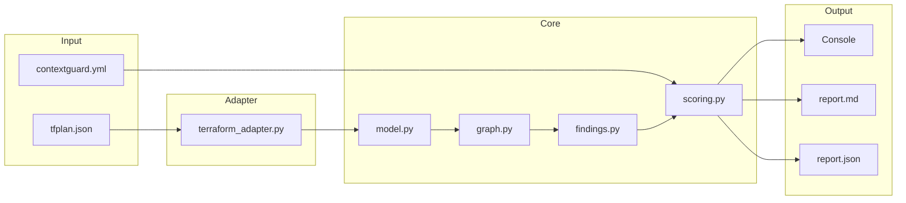

# ContextGuard

**IaC Attack Path Prioritizer** — contextual risk scoring for Terraform plans.

Static IaC scanners flag misconfigurations in isolation. ContextGuard builds a reachability graph from your Terraform plan, scores findings based on whether an attacker can actually reach the vulnerability from the internet and pivot to crown jewels, and tells you exactly where to break the attack path.

## Why This Is Different

A security group open to 0.0.0.0/0 is always flagged HIGH by traditional scanners. But:

- If it's attached to an internal-only instance behind a private LB → **noise**.
- If it's on a public ALB, 2 hops from your production database → **critical**.

ContextGuard knows the difference. It performs graph-based reachability analysis to determine what actually matters.

## Quick Start

```bash
# Install
pipx install contextguard

# Generate a Terraform plan
terraform plan -out=tfplan.bin
terraform show -json tfplan.bin > tfplan.json

# Analyze
contextguard analyze --plan tfplan.json
```

## Architecture



**Pipeline:** Parse plan → build graph with INTERNET sentinel node → BFS reachability → extract findings → contextual severity scoring → recommend breakpoints → generate reports.

## Features

### Contextual Severity Scoring

Every finding starts with a base severity, then gets re-scored based on graph reachability:

1. Not reachable from internet → downgrade to NOISE
2. Reachable, no path to crown jewel → cap at HIGH
3. Path to crown jewel ≤ 3 hops → CRITICAL
4. IAM policy with crown jewel impact actions → force CRITICAL

### Path Breakpoints

For CRITICAL and HIGH findings, ContextGuard recommends specific nodes where a control change would sever the attack path:

```
Recommended Breakpoints:
1. [network] alb-web — Add WAF or restrict listener rules on alb-web to limit inbound traffic
2. [data] db-prod — Disable public accessibility on db-prod, move to private subnet
```

Each recommendation is tailored to the node kind (load balancer, security group, IAM role, etc.).

### "What You Learned" Insights

For CRITICAL findings, the report includes contextual insights explaining why the finding is critical — not just what the misconfiguration is, but what the graph reveals:

> **What you learned**
> - This finding is critical because it sits on a 3-hop path from the internet to a crown jewel.
> - Applying controls at alb-web would break this attack path.

### CI Gating

Exit codes designed for CI pipelines:

| Code | Meaning |
|------|---------|
| 0 | Passed |
| 1 | Security gate breached |
| 2 | Input error |

Override gating at runtime:

```bash
contextguard analyze --plan tfplan.json --fail-on critical,high
```

## Supported Resources (v1)

| Category | Resources |
|----------|-----------|
| Networking | `aws_security_group`, `aws_lb`, `aws_instance`, `aws_autoscaling_group` |
| Data | `aws_db_instance` |
| IAM | `aws_iam_role`, `aws_iam_policy`, `aws_iam_role_policy`, `aws_iam_role_policy_attachment`, `aws_iam_policy_attachment` |

Unknown resources are safely skipped and counted.

## Configuration

Create `contextguard.yml`:

```yaml
crown_jewels:
  - kind: db_instance
  - tag: "sensitivity=high"

gating:
  fail_on:
    - CRITICAL
  max_path_to_crown_jewel: 4
```

Configuration is optional. Sensible defaults are applied when no config file is present.

## CLI Reference

```
contextguard analyze --plan <path> [--config <path>] [--out <dir>] [--fail-on <severities>] [--verbose]
```

| Option | Description |
|--------|-------------|
| `--plan` | Path to Terraform plan JSON (required) |
| `--config` | Path to contextguard.yml |
| `--out` | Output directory for reports (default: `.`) |
| `--fail-on` | Comma-separated severities to gate on (case-insensitive) |
| `--verbose` | Enable debug logging |

## Development

```bash
uv sync --dev
uv run ruff check contextguard/
uv run mypy contextguard/
uv run pytest --tb=short
```

## License

MIT
