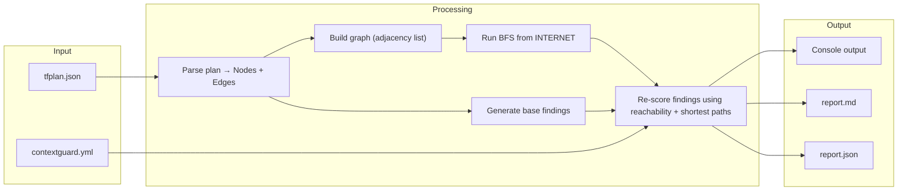

# ContextGuard
### 🛡️ IaC Attack Path Prioritizer

**Deterministic, graph-based exploitability analysis for Terraform plans.**

ContextGuard is a CLI tool that turns a Terraform plan into a **reachability graph** and prioritizes findings based on a harder question than static scanners usually ask:

> **Can an attacker actually reach this from the internet — and pivot to something that matters?**

Instead of flagging resources in isolation, ContextGuard reasons about **attack-path viability**, **distance to crown jewels**, and **contextual blast radius**.

---

## 🚀 Why this project exists

Traditional IaC scanners are useful, but they usually operate **per resource**.

They can tell you that something is misconfigured:

- an `aws_security_group` is open to `0.0.0.0/0`
- an IAM policy contains wildcards
- a database is publicly accessible

But they often do **not** tell you:

- 🌍 Is it actually reachable from the internet?
- 🔗 Can it pivot to a sensitive asset?
- 👑 Does it form a viable path to a crown jewel?
- 🚨 Is this truly urgent, or just noise?

That gap creates **alert fatigue**. Engineers end up manually reconstructing reachability and blast radius in their heads.

ContextGuard exists to move that reasoning into the engine itself.

---

## ✨ Why ContextGuard is different

ContextGuard does not stop at “this resource is risky.”

It asks whether the finding is dangerous **in context**.

### It prioritizes by:

- 🔍 **real internet reachability**
- 🔗 **graph-based pivot paths**
- 👑 **distance to crown jewels**
- 🧠 **deterministic contextual severity overrides**
- 🛠️ **breakpoints that sever the attack path**

That means the output is not just a list of violations — it is a **structured explanation of exploitability**.

---

## 🧠 Core idea

ContextGuard converts a Terraform plan into a directed reachability graph, for example:

```text
INTERNET → Load Balancer → Instance → Database (👑 Crown Jewel)
```

Every finding goes through two stages:

1. **Base severity** — static misconfiguration rule
2. **Contextual override** — graph-based exploitability reasoning

### Example outcomes

| Condition | Result |
|---|---|
| Not reachable from the internet | Downgraded to `NOISE` |
| Reachable, but no path to crown jewel | Capped at `HIGH` |
| Short path to crown jewel (`≤ 3` hops) | Escalated to `CRITICAL` |
| IAM privilege escalation impacting crown jewels | Forced `CRITICAL` |

ContextGuard does not just say **what is wrong** — it explains **why it matters**, or why it does not.

---

## 🧭 Design principles

- 📐 **Evidence only** — no speculative heuristic inference
- 🔁 **Deterministic output** — same input → same JSON
- 🧩 **Provider-agnostic core** — cloud-specific adapters stay isolated from the reasoning engine
- 🚦 **Security as enforcement** — CI exit codes, not just suggestions
- 🔧 **Actionable remediation** — recommend breakpoints, not vague advice

---


---

## 🏗️ Architecture


```mermaid
flowchart LR
  subgraph Input
    A["tfplan.json"]
    B["contextguard.yml"]
  end

  subgraph Processing
    C["Parse plan → Nodes + Edges"]
    D["Build graph (adjacency list)"]
    E["Run BFS from INTERNET"]
    F["Generate base findings"]
    G["Re-score findings using reachability + shortest paths"]
  end

  subgraph Output
    H["Console output"]
    I["report.md"]
    J["report.json"]
  end

  A --> C
  C --> D
  D --> E
  C --> F
  E --> G
  F --> G
  B --> G
  G --> H
  G --> I
  G --> J
```

**Pipeline:** Parse plan → build graph with INTERNET sentinel node → derive forward edges from SG ingress rules → BFS reachability → extract findings → contextual severity scoring → recommend breakpoints → generate reports.

---


### High-level pipeline

```text
Terraform plan JSON
  → resource extraction
  → graph construction
  → INTERNET sentinel attachment
  → forward-edge derivation from explicit SG ingress evidence
  → BFS reachability analysis
  → finding extraction
  → contextual severity scoring
  → breakpoint recommendation
  → report generation
```

### Main stages

#### 1. Plan parsing
ContextGuard consumes a Terraform plan JSON and extracts supported infrastructure resources and security-relevant relationships.

#### 2. Graph construction
Resources are modeled as graph nodes. Reachability edges are derived from explicit evidence such as ingress rules.

A synthetic **`INTERNET` sentinel node** acts as the origin for public exposure analysis.

#### 3. Reachability analysis
The engine runs **forward reachability** using graph traversal to determine:

- which nodes are internet-reachable
- what downstream assets can be reached from them
- whether any path leads to a crown jewel

#### 4. Contextual severity override
Static findings are re-scored using the graph:

- downgrade findings with no exploitable entry path
- escalate findings that sit on a short path to sensitive assets
- force severity when IAM privilege paths affect crown jewels

#### 5. Breakpoint recommendation
For important findings, the engine identifies where a control change would sever the attack path most effectively.

#### 6. Report generation
ContextGuard emits both:

- human-readable Markdown
- machine-readable JSON
- run metadata for CI / automation contexts

---

## 🔥 What makes this project interesting

ContextGuard is not just a parser and not just a rule engine.

It is interesting because it combines several strong ideas in one deterministic security workflow:

- 🌐 **internet-to-asset reachability reasoning**
- 🔗 **attack-path modeling over IaC plans**
- 👑 **crown-jewel-aware prioritization**
- 🧠 **deterministic graph-based scoring**
- 🛠️ **breakpoint-oriented remediation guidance**
- 📋 **auditable evidence for every derived edge**

This moves the tool closer to **contextual exposure analysis** than to a basic misconfiguration linter.

---

## 🧪 Example attack-path reasoning

Consider this path:

```text
INTERNET → alb-web → app-instance → db-prod
```

Assume:

- `alb-web` is exposed through an ingress rule permitting public access
- `app-instance` accepts traffic from the load balancer’s security group
- `db-prod` accepts traffic from the application instance
- `db-prod` is tagged or configured as a **crown jewel**

ContextGuard can reason that:

1. `alb-web` is reachable from the internet
2. `app-instance` is reachable from `alb-web`
3. `db-prod` is reachable downstream from `app-instance`
4. the public exposure is not isolated — it forms a viable path to a sensitive asset
5. severity should therefore be escalated based on real blast radius, not just surface-level exposure

That is the key shift: a public edge matters more when it is the start of a short path to something important.

---

## 📊 Contextual severity scoring

Every finding starts with a base severity and is then re-scored according to graph context.

### Current reasoning rules

- 🚫 **Not reachable from internet** → downgrade to `NOISE`
- ⚠️ **Reachable, but no crown-jewel path** → cap at `HIGH`
- 🔥 **Path to crown jewel ≤ 3 hops** → escalate to `CRITICAL`
- 👑 **IAM privilege escalation affecting crown jewels** → force `CRITICAL`

This is what turns ContextGuard from a static scanner into a **risk prioritization engine**.

---

## 🔗 Path breakpoints

For `CRITICAL` and `HIGH` findings, ContextGuard recommends **specific breakpoints** where a control change would sever the path.

Example:

```text
Recommended Breakpoints:
1. [network] alb-web — Add WAF or restrict listener rules on alb-web to limit inbound traffic
2. [data] db-prod — Disable public accessibility on db-prod, move to private subnet
```

These are not generic recommendations. They are tied to the actual path and tailored to the node kind.

---

## 💡 "What You Learned" insights

For significant exposures, reports include contextual explanations such as:

> This database is not just public — it sits 3 hops from the internet via `alb-web`. Applying a control at `alb-web` breaks this attack path entirely.

This turns findings into **explainable risk narratives**, which is far more useful during triage than a raw severity label.

---

## 🔎 Evidence-based reachability

ContextGuard derives forward edges from **explicit infrastructure evidence**, not from vague assumptions.

For example:

- load balancer → instance edges are derived from explicit security group rules
- instance → database edges are derived from explicit ingress relationships
- nodes are not connected merely because they share a subnet or appear related by naming

Each derived edge can carry:

- the underlying rule evidence
- the reasoning path that justified the edge
- a confidence / traceability trail for debugging and auditability

This matters because security reasoning should be **explainable and reviewable**, not magical.

---

## 🚦 CI gating

ContextGuard is designed to be used as an enforcement step in CI.

### Exit codes

| Code | Meaning |
|---|---|
| `0` | Passed |
| `1` | Security gate breached |
| `2` | Input error |

### Example GitHub Actions step

```yaml
- name: ContextGuard scan
  run: contextguard analyze --plan tfplan.json --out ./reports --fail-on critical,high
```

This makes security posture part of delivery automation, not just manual review.

---

## 📦 Supported resources (v1)

### Current implementation scope

ContextGuard currently focuses on **Terraform plans with AWS resource support** in the first version.

| Category | Resources |
|---|---|
| Networking | `aws_security_group`, `aws_lb`, `aws_instance`, `aws_autoscaling_group` |
| Data | `aws_db_instance` |
| IAM | `aws_iam_role`, `aws_iam_policy`, `aws_iam_role_policy`, `aws_iam_role_policy_attachment`, `aws_iam_policy_attachment` |

Unknown resources are **safely skipped and counted**, rather than guessed.

This keeps the engine conservative and deterministic while leaving room for additional adapters later.

---

## 🔧 Configuration

ContextGuard can be configured with an optional `contextguard.yml`.

Example:

```yaml
crown_jewels:
  - kind: db_instance
  - tag: "sensitivity=high"

gating:
  fail_on:
    - CRITICAL
  max_path_to_crown_jewel: 4
```

### Configuration allows you to define:

- 👑 how to identify crown jewels
- 🚦 which severities should fail CI
- 📏 path-distance thresholds used in prioritization

If no config file is provided, **sensible defaults** are applied.

---

## 🚀 Quick start

### Prerequisites

- Python 3.11+
- Terraform CLI (to generate Terraform plan JSON)

### Installation

```bash
pip install .
# or
pipx install .
# or
pip install -e .
```

You can also run without installing:

```bash
python -m contextguard --help
```

### Try it immediately

The repository ships with an example plan:

```bash
contextguard analyze --plan examples/sample-tfplan.json --out ./reports
```

### Full workflow

```bash
# 1. Generate a Terraform plan
terraform plan -out=tfplan.bin
terraform show -json tfplan.bin > tfplan.json

# 2. Analyze
contextguard analyze --plan tfplan.json --out ./reports

# 3. Review
#    ./reports/report.md          — human-readable Markdown report
#    ./reports/report.json        — machine-readable JSON report
#    ./reports/run-metadata.json  — timestamp, paths, run context
```

---

## 📖 CLI reference

```bash
contextguard analyze --plan <path> [--config <path>] [--out <dir>] [--fail-on <severities>] [--no-mermaid] [--verbose]
```

| Option | Description |
|---|---|
| `--plan` | Path to Terraform plan JSON (required) |
| `--config` | Path to `contextguard.yml` |
| `--out` | Output directory for reports (default: current directory) |
| `--fail-on` | Comma-separated severities to gate on |
| `--no-mermaid` | Suppress Mermaid diagram in `report.md` |
| `--verbose` | Enable debug logging |

---

## 🛠 Development

```bash
uv sync --dev
uv run ruff check contextguard/
uv run mypy contextguard/
uv run pytest --tb=short
```

Current test suite: **~90 tests**.

---

## ✅ What this project demonstrates

ContextGuard demonstrates how to apply **graph reasoning and deterministic analysis** to infrastructure security.

More specifically, it shows:

- 🧠 attack-path-aware risk prioritization
- 🌐 explicit internet reachability analysis
- 👑 crown-jewel-aware severity scoring
- 🔎 evidence-based edge derivation
- 🛠 actionable remediation through path breakpoints
- 🚦 CI-friendly enforcement semantics
- 📦 clean CLI-driven report generation

---

## ⚖️ Trade-offs and current limitations

ContextGuard is intentionally conservative.

### Current trade-offs

- it prefers **evidence-backed reachability** over aggressive inference
- it currently focuses on **Terraform + AWS-first support** rather than broad provider coverage
- it prioritizes **determinism and auditability** over probabilistic risk modeling
- it is static-plan-based, so it does not see runtime-only drift or live network state

### Current limitations

- no runtime cloud-state enrichment yet
- provider coverage is intentionally limited in v1
- unknown resources are skipped rather than approximated
- attack paths are bounded by what can be proven from the plan and configuration evidence

These are acceptable trade-offs for a tool whose main value is **precise, explainable prioritization**.

---

## 👤 Credits

All credits go to **Shaked Arazi**.

ContextGuard was designed and implemented with a strong emphasis on deterministic reasoning, explicit graph modeling, and actionable infrastructure security analysis.

