# 🛡️ ContextGuard

**IaC Attack Path Prioritizer** — Deterministic, graph-based risk reasoning for IaC plans.

Static IaC scanners list misconfigurations. ContextGuard asks a harder question:

> *Can an attacker actually reach this from the internet — and pivot to something that matters?*

Instead of flagging resources in isolation, ContextGuard builds a reachability graph from your Terraform plan and scores findings based on real exploitability in context.

---

## 🔍 The Problem

Traditional scanners operate per-resource. They'll flag:

- A security group open to `0.0.0.0/0`
- A wildcard IAM policy
- A publicly accessible database

But they don't answer:

- Is this reachable from the internet?
- Can it pivot to a production database?
- Does it actually form a viable attack path?

This creates **alert fatigue** — engineers are forced to manually reason about reachability and blast radius.

---

## ⚙️ What ContextGuard Does Differently

ContextGuard converts your Terraform plan into a directed reachability graph:

```
INTERNET → Load Balancer → Instance → Database (👑 Crown Jewel)
```

Every finding goes through two stages:

1. **Base severity** — static misconfiguration rule
2. **Contextual override** — graph-based exploitability

This means:

| Condition | Result |
| --------- | ------ |
| Not reachable from the internet | Downgraded to **NOISE** |
| Reachable but no path to sensitive asset | Capped at **HIGH** |
| Short path to crown jewel (≤ 3 hops) | Escalated to **CRITICAL** |
| IAM privilege escalation impacting crown jewels | Forced **CRITICAL** |

ContextGuard doesn't just tell you what's wrong — it tells you **why it matters**, or why it doesn't.

---

## 🧭 Design Principles

- 📐 **Evidence only** — no heuristic inference
- 🔁 **Deterministic output** — same input → same JSON, every time
- 🧩 **Provider-agnostic core** — adapters isolated from the engine
- 🚦 **Security as enforcement** — CI exit codes, not suggestions
- 🔧 **Actionable remediation** — breakpoints, not vague advice

---

## 🚀 Quick Start

### Prerequisites

- **Python 3.11+**
- **Terraform CLI** (to generate a plan JSON)

### Installation

```bash
pip install .                # standard install
# or
pipx install .               # isolated install
# or
pip install -e .             # editable (for development)
```

You can also run without installing:

```bash
python -m contextguard --help
```

### Try it now

The repo ships an example plan you can use immediately:

```bash
contextguard analyze --plan examples/sample-tfplan.json --out ./reports
```

### Full workflow

```bash
# 1. Generate a Terraform plan
terraform plan -out=tfplan.bin
terraform show -json tfplan.bin > tfplan.json

# 2. Analyze
contextguard analyze --plan tfplan.json --out ./reports

# 3. Review
#    ./reports/report.md          — human-readable Markdown report
#    ./reports/report.json        — machine-readable JSON report
#    ./reports/run-metadata.json  — timestamp, paths, run context
```

---

## 🏗️ Architecture

```mermaid
flowchart LR
  subgraph Input
    A["tfplan.json"]
    B["contextguard.yml"]
  end

  subgraph Processing
    C["Parse plan → Nodes + Edges"]
    D["Build graph (adjacency list)"]
    E["Run BFS from INTERNET"]
    F["Generate base findings"]
    G["Re-score findings using reachability + shortest paths"]
  end

  subgraph Output
    H["Console output"]
    I["report.md"]
    J["report.json"]
  end

  A --> C
  C --> D
  D --> E
  C --> F
  E --> G
  F --> G
  B --> G
  G --> H
  G --> I
  G --> J
```



**Pipeline:** Parse plan → build graph with INTERNET sentinel node → derive forward edges from SG ingress rules → BFS reachability → extract findings → contextual severity scoring → recommend breakpoints → generate reports.

---

## ✨ Features

### 📊 Contextual Severity Scoring

Every finding starts with a base severity, then gets re-scored based on graph reachability:

1. Not reachable from internet → downgrade to **NOISE**
2. Reachable, no path to crown jewel → cap at **HIGH**
3. Path to crown jewel ≤ 3 hops → **CRITICAL**
4. IAM policy with crown jewel impact actions → force **CRITICAL**

### 🔗 Path Breakpoints

For CRITICAL and HIGH findings, ContextGuard recommends specific nodes where a control change would sever the attack path:

```
Recommended Breakpoints:
1. [network] alb-web — Add WAF or restrict listener rules on alb-web to limit inbound traffic
2. [data] db-prod — Disable public accessibility on db-prod, move to private subnet
```

Each recommendation is tailored to the node kind (load balancer, security group, IAM role, etc.).

### 💡 "What You Learned" Insights

For critical exposures, reports include contextual insight:

> *This database is not just public — it sits 3 hops from the internet via alb-web. Applying a control at alb-web breaks this attack path entirely.*

This transforms findings from static violations into explainable risk narratives.

### 🔎 Evidence-Based Reachability

Forward edges (LB → Instance, Instance → DB) are derived from explicit Security Group ingress rules — not inferred from shared membership or subnet co-residency. Each derived edge includes a confidence level and the exact SG rule evidence used, making every reachability claim auditable and debuggable.

### 🚦 CI Gating

Exit codes designed for CI pipelines:

| Code | Meaning |
| ---- | ---------------------- |
| 0 | Passed |
| 1 | Security gate breached |
| 2 | Input error |

Example GitHub Actions step:

```yaml
- name: ContextGuard scan
  run: contextguard analyze --plan tfplan.json --out ./reports --fail-on critical,high
```

---

## 📦 Supported Resources (v1)

| Category | Resources |
| ---------- | ---------------------------------------------------------------------------------------------------------------------- |
| Networking | `aws_security_group`, `aws_lb`, `aws_instance`, `aws_autoscaling_group` |
| Data | `aws_db_instance` |
| IAM | `aws_iam_role`, `aws_iam_policy`, `aws_iam_role_policy`, `aws_iam_role_policy_attachment`, `aws_iam_policy_attachment` |

Unknown resources are safely skipped and counted.

---

## 🔧 Configuration

Create a `contextguard.yml` (see `examples/contextguard.yml`):

```yaml
crown_jewels:
  - kind: db_instance
  - tag: "sensitivity=high"

gating:
  fail_on:
    - CRITICAL
  max_path_to_crown_jewel: 4
```

Configuration is optional — sensible defaults are applied when no config file is present.

---

## 📖 CLI Reference

```
contextguard analyze --plan <path> [--config <path>] [--out <dir>] [--fail-on <severities>] [--no-mermaid] [--verbose]
```

| Option | Description |
| ------------- | -------------------------------------------------------- |
| `--plan` | Path to Terraform plan JSON (required) |
| `--config` | Path to contextguard.yml |
| `--out` | Output directory for reports (default: `.`) |
| `--fail-on` | Comma-separated severities to gate on (case-insensitive) |
| `--no-mermaid` | Suppress Mermaid diagram in report.md |
| `--verbose` | Enable debug logging |

---

## 🛠️ Development

```bash
uv sync --dev
uv run ruff check contextguard/
uv run mypy contextguard/
uv run pytest --tb=short  # 90 tests
```

---

## 👤 Credits

All credits go to **Shaked Arazi**.
